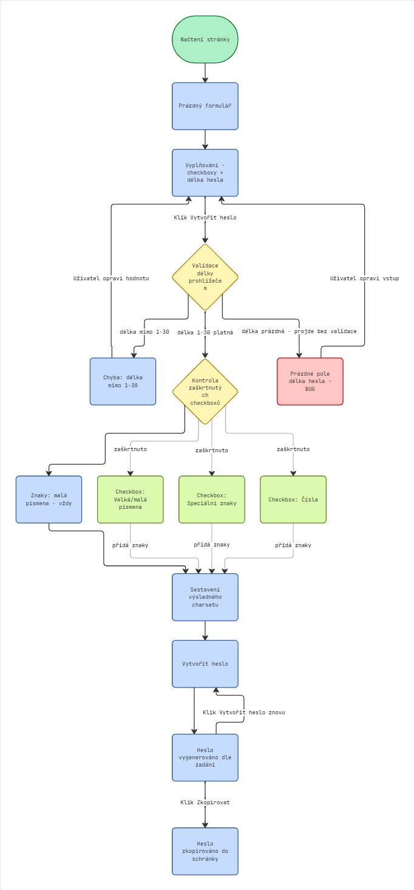
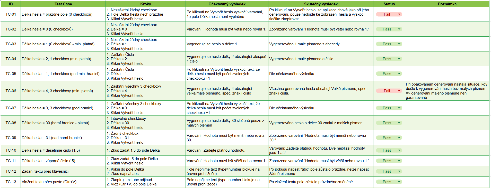
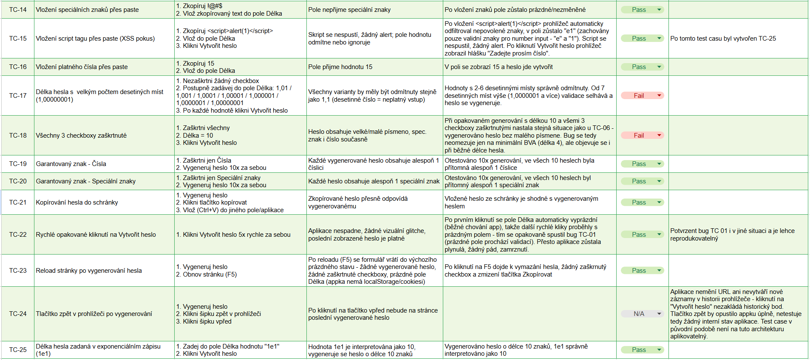

# Testing – Generate-password

Manuální testování aplikace [Generate-password](https://tomaspolak82-commits.github.io/Generate-password/).

## Shrnutí

- Celkem test cases: **25**
- Pass: **20**
- Fail: **4**
- N/A: **1**

## Testovací flow

Diagram zachycuje testovaný flow aplikace včetně prvního nalezeného bugu (prázdné pole u délky hesla obchází validaci).

## Test cases

Kompletní přehled test cases, kroků, očekávaných a skutečných výsledků: [test-cases.md](./test-cases.md)

Vizuální náhled (pro rychlou orientaci):

## Nalezené bugy

Detailní bug reporty: [bug-reports.md](./bug-reports.md)

Přehled:

1. **Validace délky hesla se u prázdného pole obchází** (TC-01) – aplikace vygeneruje heslo místo zobrazení varování o nevyplněném poli.
2. **Garance malého písmene v heslu neplatí vždy** (TC-06, TC-18) – při zaškrtnutí všech 3 checkboxů může vygenerované heslo obsahovat velké písmeno, speciální znak i číslo, ale chybí v něm malé písmeno. Ověřeno jak na minimální hranici (délka 4), tak při běžné délce (10).
3. **Nekonzistentní validace desetinných čísel u pole Délka** (TC-17) – čísla s 2–6 desetinnými místy jsou správně odmítnuta, od 7 desetinných míst výše validace selže a heslo se vygeneruje.

## Testovací přístup

Použité testovací techniky:
- **Boundary Value Analysis** – testování hranic délky hesla (0/1/30/31), včetně dynamické dolní hranice závislé na počtu zaškrtnutých checkboxů
- **Equivalence Partitioning** – platné/neplatné vstupy (text, speciální znaky, desetinná a záporná čísla)
- **Negative testing** – XSS pokus (script tag), neplatné vstupy přes paste
- **Exploratory testing** – rychlé opakované klikání, reload, chování prohlížeče (bfcache/historie), vytvoření TC po nalezené chybě

## Poznámka k procesu 

Testování (návrh scénářů, exekuce, nálezy bugů) je moje vlastní práce. Při formulaci a strukturování test cases a dokumentace jsem využil AI asistenta (Claude) jako sparring partnera pro detaily formátování a formulace.
